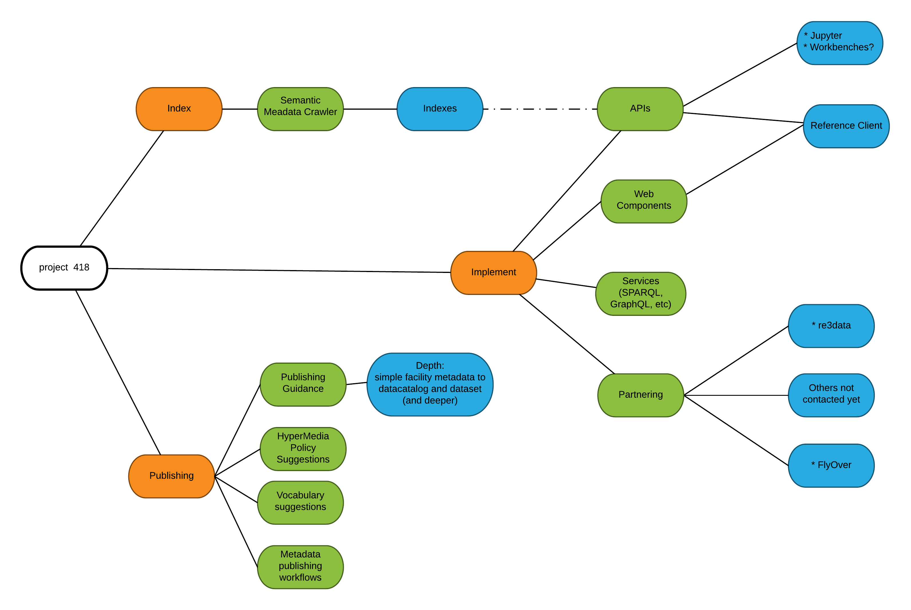
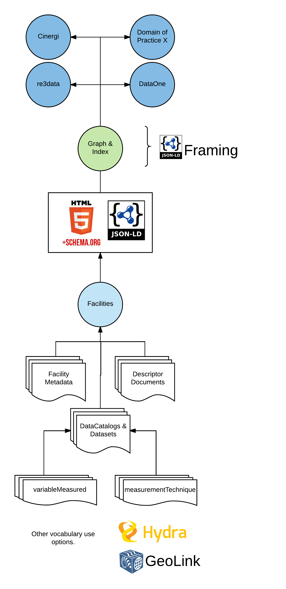
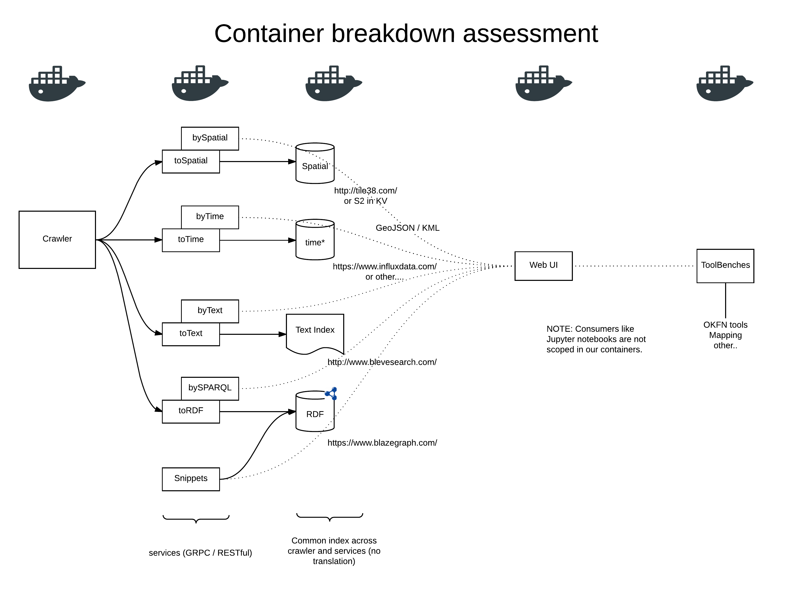
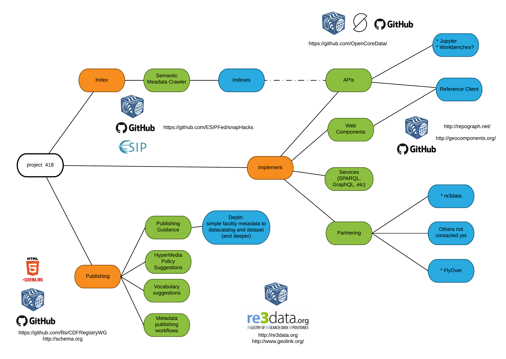

class: center, middle, inverse

# Project 418
## ESSO subcontract
### Introduction

---
### TL;DR
#### Philosophy:   \#UseThePlatform
#### Keywords: Semantic metadata, HTML5 (microdata), hypermedia, web components, web architecture
#### Mission:  
* Demonstrate and Facilitate self publication of semantic metadata on the web following web architecture patterns (extended to data)
* Demonstrate the web architecture based consumption and example uses of these resources (more advanced hypermedia driven approaches)
* Use these approaches to provide a registry of resources (initially; facilities, services, data) 
* Demonstrate indexing these resources and using those indexes (semantic, text, spatial) to facilitate discovery and inspection of resources
* Develop patterns for access via APIs to allow access and use of these indexes in tools such a applications, notebooks and web sites. 
* Demonstrate and publish patterns for others to use or implement for both publishing and consuming these semantic metadata documents

Publish, Index, Implement

---
### Pictures are nice

 

---
#### Publish 
 

 Publication will take place via HTML5 microdata pattern and follow development in the EC RWG.
 
Goals:
* Demonstrate approaches to easy the publishing of semantic metadata by leveraging existing metadata workflows
* Review the assessment of semantic metadata on organic search (Google, Bing, Yandex, etc) using commercial web developer tools like Google WebMaster Tools  (address broader impact of this approach to support adoption)
* Blunt goal:  See if we can demonstrate easy HTML5 semantic metadata publication at an level of cost lower than the benefits received from doing it
* Blunt goal2:  Demonstrate approach drilling down through data catalog to data set and beyond to methods and parameters

---
#### Index
Indexing considerations

* Work in places to use JSON-LD combined with Framing to provide hypermedia navigation guidance.   Potentially no advanced hypermedia vocabularies neccessary
* Indexes uses best practices: 
    * JSON-LD is RDF data model based, easy translation to RDF triples, full semantic context carried
    * Text indexing and ranking  (connectable to the graph)
    * Spatial indexing (geohashing)
* Simple API access

* Blunt goal:  Demonstrate easy crawling of semantic metadata net using nothing more than existing libraries and web architecture principles. 

* Work to date at [Earth RWG](https://github.com/fils/CDFRegistryWG) and [ESIP Snaphack sh01](https://github.com/ESIPFed/snapHacks)
---
#### Implement
* APIs and services will enable libraries for notebooks and allow for REST gateways.
* Harvesting patterns and code all open (all development in the open) to allow others to use or implement based on patterns
* Fully docker-ized implementation hosted on XSEDE, easy replication by 3rd parties  (would like to work with re3 and others on this point)

 

---
### Leveraging work to date
 

---
### Conclusion

* Development will be in the open
* Follow us on GitHub, engage with us through many points (various repos, ESIP, EarthCube, etc)
* C'ya in April!
