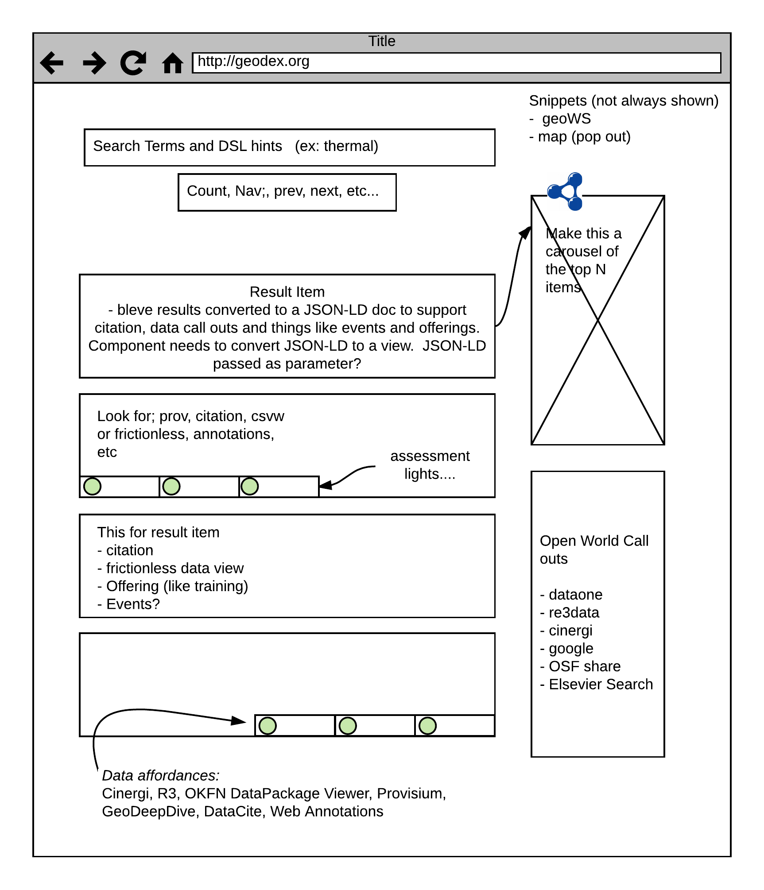

### A rolling status update document
#### Revised Oct 30th 2017 

### Functional Goals
The following block quote items represent the next set of functional 
goals for P418.  These goals will help prioritize and drive development
of the items in the *Outline of activities*

> Demonstrate we can read at least two domains and via sitemap.xml and process 
> the content into both text and graph indexes.

> Demonstrate JSON-LD framing for file info and spatial data.

> Demonstrate RESTful calls for the text index and potentially the graph index.

> Demonstrate access to full semantic metadata in indexes on a per resource level to 
> support detail views on resources matching search criteria in UI or service calls.

> Demonstrate passing information from indexes to a UI that supports basic tool actions.  This UI 
> might be a notebook, rather than web based. 

### Outline of activities

1. Initial activities
    - [x]  deploy vocabulary  https://geodex.org/voc/ 
    - [x]  instance on XSEDE 
    - [x]  reference UI based on RWG work   https://geodex.org  
    - [x]  Initial crawl against Open Core (not sitemap driven)
1. Provider outreach
     - [ ] develop out [publishing document](https://github.com/earthcubearchitecture-project418/p418Docs/blob/master/publishing.md)
     - [ ] pattern to include file mime type (for connections)
     - [ ] pattern to include/find facility  UUID (for facility connections)
     - [ ] Coordination with Google interest Ref: [Publishing](https://github.com/earthcubearchitecture-project418/p418Docs/blob/master/publishing.md)
     - [ ] DataCite API
1. Crawling activity
    - [ ] Update crawling code to simpler sitemap approach
    - [ ] Implement JSON-LD framing code 
        - [ ] for spatial (See Footnote 1)
        - [ ] for download ref (location and type) (See Footnote 2)
        - [ ] for organization info (See Footnote 3) 
1. Indexing activity
    - [ ] Resolution of GRPC or microservice pattern for crawler to index connections.  This 
    may be a bit different given the sitemap pattern making concurrency easier to implement. 
    - [x] Bleve indexer update  prototype
    - [x] JSON-LD indexer blank node resolution
    - [ ] RDF indexer
    - [ ] Spatial indexer
    - [ ] Temporal indexer
1. Interface task list.  As part of this we will also be exploring connections to existing and 
past EarthCube funded projects. 
    - [ ] Service call for text index search (RESTful)  (See Footnote 4)
    - [ ] Web based UI (can be more than one) (See Footnote 5)
    - [ ] Notebook based UI (needs services first) [placeholder](https://github.com/earthcubearchitecture-project418/p418Notebooks/blob/master/Notebook1.ipynb)
    - [ ] Web component development for easy UI development  (Downstream activity)

#### Footnote 1:
Spatial API will be generated in conformance with the [Flyover Country](http://fc.umn.edu/) pattern
like that implemented in Open Core Data.  This will allow the app to request datasets spatial 
present along a given flight track.

#### Footnote 2:
The use of a location URL and type is a fist step in *data affordances*.  These are methods to 
connect data resources with tools.   A concept of this can be seen in this
[OKFN DataPackage Viewer](http://data.okfn.org/tools/view?url=https%3A%2F%2Fraw.githubusercontent.com%2FOpenCoreData%2FocdGarden%2Fmaster%2Ffrictionlessdata%2FfdpDemo%2Fdatapackage.json).  Here a data package being crafted for Open Core Data is passed as an 
arguement for the OKFN DataPackage viewer.  It then opens and displays the content in a user focused manner
including looking for metadata related to plotting hints and generating a plot based on these parameters.

#### Footnote 3:
The ability to frame data out of the graph fragments represented by the semantic metadata 
has several use cases.   One will be to use this approach to connect datasets to hosting facilities and 
the on to a potential record for that facility at a place like [RE3Data](http://re3data.org).

#### Footnote 4:
Search function tree: This sketch is included as a discussion aid.  It represents an initial 
assessment of potential search *vectors* that the indexing could potentially support.  It's 
unlikely all these vectors will be fully realized.  However, this acts as a strong guide for
development of the indexes, UIs and services. 

#### Footnote 5:
UI concepts: This sketch is included as a discussion aid.  It highlights some of the
potential functional goals included data resources assessment and data affordances (the actionable properties between the world and an actor) connections
among other features.  

