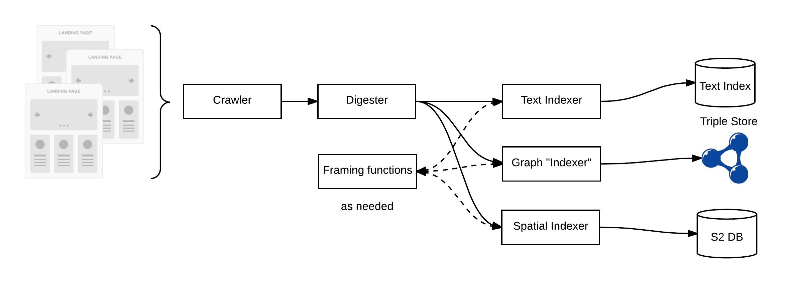
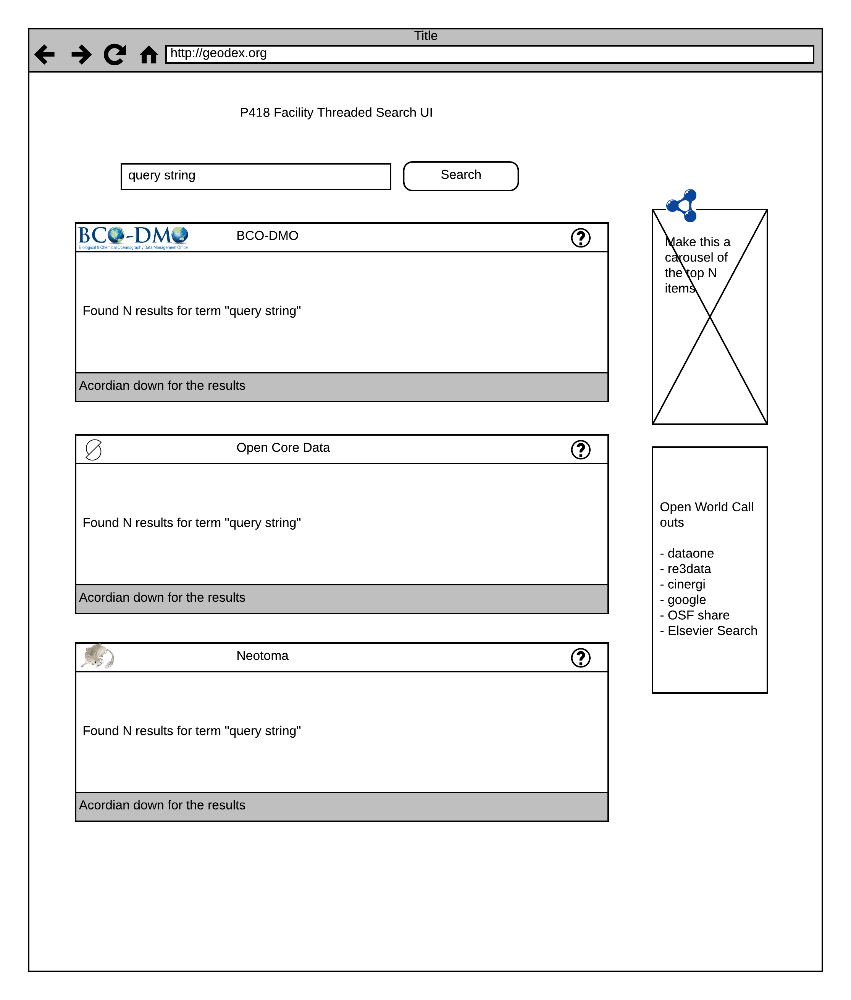

### A rolling status update document

### OUT OF DATE

### Points of discussion

  Note:
 We still need to integrate update logic into the indexer.   Updating the RDF triple 
 store should be relatively straightforward, though a bit tedious as envisioned now.  
 Additionally, the spatial index likely will allow updating a resource on a per ID basis.  As 
 a KV store, it should be easier to address.   The process
 for Bleve is less clear (as in I haven't looked at it) so whether it is easy or hard is an 
 unknown.  

### Footnotes

#### Footnote 1:
Spatial API will be generated in conformance with the [Flyover Country](http://fc.umn.edu/) pattern
like that implemented in Open Core Data.  This will allow the app to request datasets spatial 
present along a given flight track.  The index will likely be a geohash based approach 
using something like a S2 library.  

#### Footnote 2:
The use of a location URL and type is a fist step in *data affordances*.  These are methods to 
connect data resources with tools.   A concept of this can be seen in this
[OKFN DataPackage Viewer](http://data.okfn.org/tools/view?url=https%3A%2F%2Fraw.githubusercontent.com%2FOpenCoreData%2FocdGarden%2Fmaster%2Ffrictionlessdata%2FfdpDemo%2Fdatapackage.json).  Here a data package being crafted for Open Core Data is passed as an 
arguement for the OKFN DataPackage viewer.  It then opens and displays the content in a user focused manner
including looking for metadata related to plotting hints and generating a plot based on these parameters.

#### Footnote 3:
The ability to frame data out of the graph fragments represented by the semantic metadata 
has several use cases.   One will be to use this approach to connect datasets to hosting facilities and 
the on to a potential record for that facility at a place like [RE3Data](http://re3data.org).

#### Footnote 4:
A high level overview of the indexing process as it stands now.  The "crawler" simply accesses and 
processes sitemaps.  These URLs are concurrently processed through spatial, graph and text indexers.

#### Footnote 5:
Search function tree: This sketch is included as a discussion aid.  It represents an initial 
assessment of potential search *vectors* that the indexing could potentially support.  It's 
unlikely all these vectors will be fully realized.  However, this acts as a strong guide for
development of the indexes, UIs and services. 

#### Footnote 6:
UI concepts: This sketch is included as a discussion aid.  It highlights some of the
potential functional goals included data resources assessment and data affordances (the actionable properties between the world and an actor) connections
among other features.  

#### Footnote 7:
UI concepts: This sketch is included as a discussion aid.  It presents the threaded results
view where results are grouped by provider with the provider of the highest ranked individual return first
and so on.  

